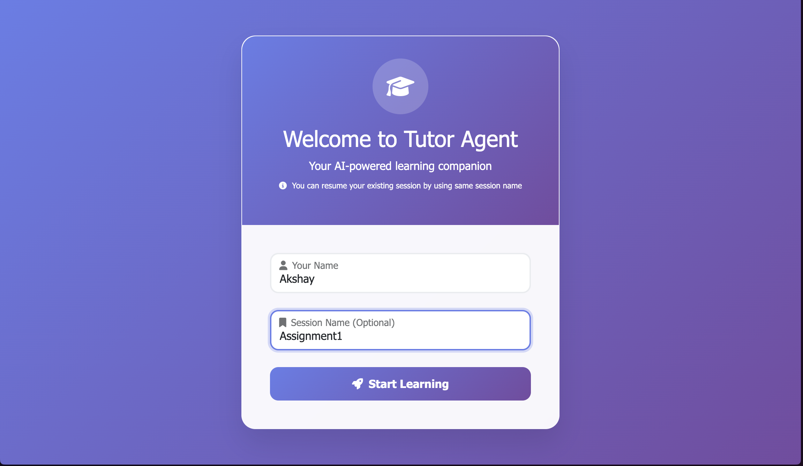
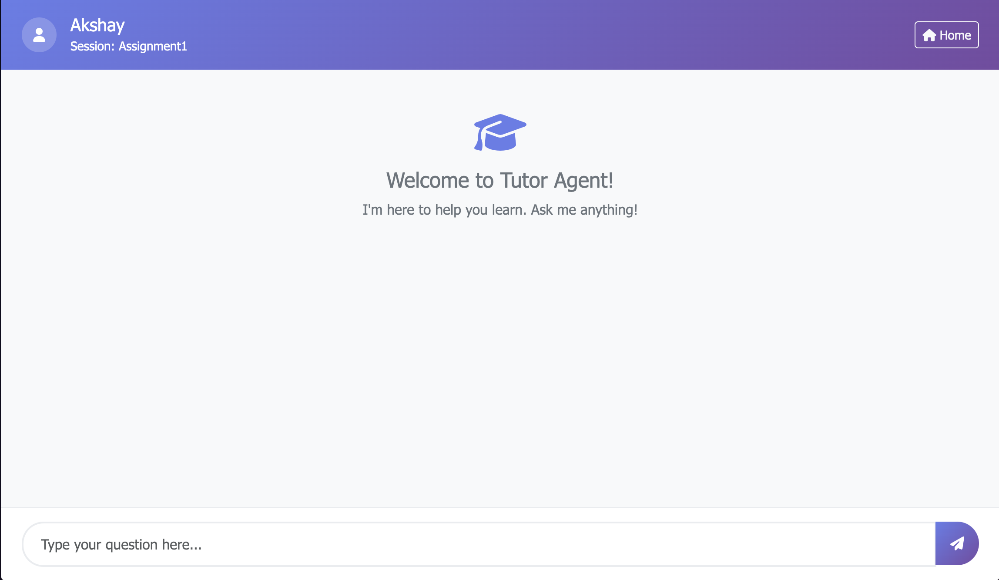
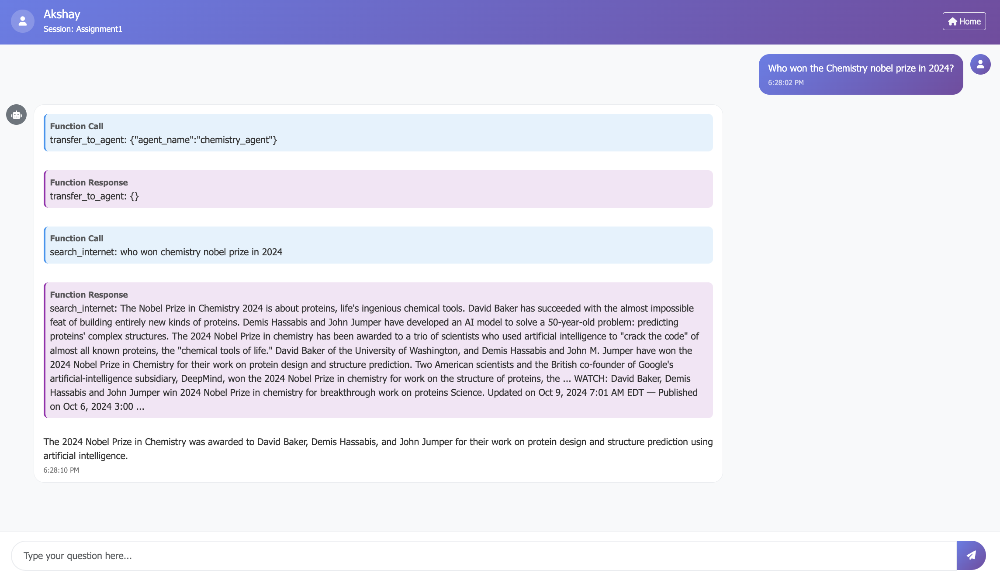

# Tutor Agent


Tutor Agent is an AI-powered web application designed to assist students in subjects like Physics, Math, and Chemistry. It uses specialized sub-agents and tools to provide accurate, real-time help. Built with Python, FastAPI, and google-adk.


# Features
- **Physics Sub-Agent**: Handles physics-related queries.
    - **evaluate_exprression**: Evaluates mathematical expressions.
    - **convert_units_general**: Converts units of measurement.
- **Math Sub-Agent**: Handles math-related queries.
    - **evaluate_exprression**: Evaluates mathematical expressions.
    - **solve_polynomial**: Solves polynomial equations of nth order.
- **Chemistry Sub-Agent**: Handles chemistry-related queries.
    - **search_internet** :Searches the internet for chemistry-related information.
    - **get_atomic_properties**: Retrieves atomic properties of elements.


# How to run

1. Clone the repository:
   ```bash
    git clone https://github.com/ACakshay/tutor-agent.git
    cd tutor-agent
    ```
2. Install the required dependencies:
    ```bash
    pip install uv
    uv sync 

3. create a `.env` file in the root directory or as a environment variable with the following content:
    ```plaintext
    GOOGLE_GENAI_USE_VERTEXAI=FALSE
    GOOGLE_API_KEY=your_google_api_key
    ```
   Replace `your_google_api_key` with your actual API keys.

3. Run the agent:
    ```bash
    uv run uvicorn main:app --host=0.0.0.0 --port=8000
    ```
4. Access the agent:
   Open your web browser and go to `http://localhost:8000/` to interact


# How to use

open your web browser and go to `http://localhost:8000/` to interact with the Tutor Agent.

# Screenshot


Give your name and optional session ID (you can resume your session later using the same session ID) and start asking questions 







# API Documentation

You can find the API documentation at `http://localhost:8000/docs` after running the agent.


# Folders Structure

```
.
├── README.md
├── main.py
├── ui.py
├── pyproject.toml
├── requirements.txt
├── dockerfile
├── templates   
│   ├── chat.html
│   └── index.html
├── tutor_agent
│   ├── __init__.py
│   ├── agent.py
|   ├── common_tools.py
│   ├── chemistry_agent 
│   │   ├── __init__.py
│   │   ├── agent.py
│   │   └── tools.py
│   ├── math_agent
│   │   ├── __init__.py
│   │   ├── agent.py
│   │   └── tools.py
│   └── physics_agent
│       ├── __init__.py
│       ├── agent.py
│       └── tools.py
├── uv.lock
└── vercel.json
```


# License
Copyright (c) 2025 Akshay

All rights reserved.

Unauthorized copying, modification, distribution, or use of this code or any part of it is strictly prohibited without explicit written permission from the author.

This software is provided "as is", without warranty of any kind, express or implied.

